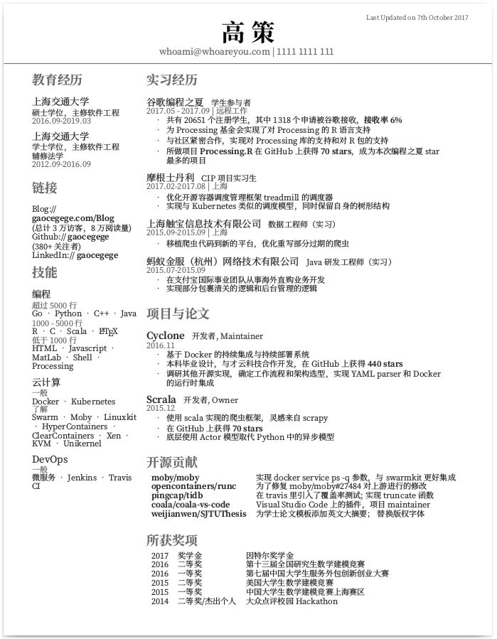
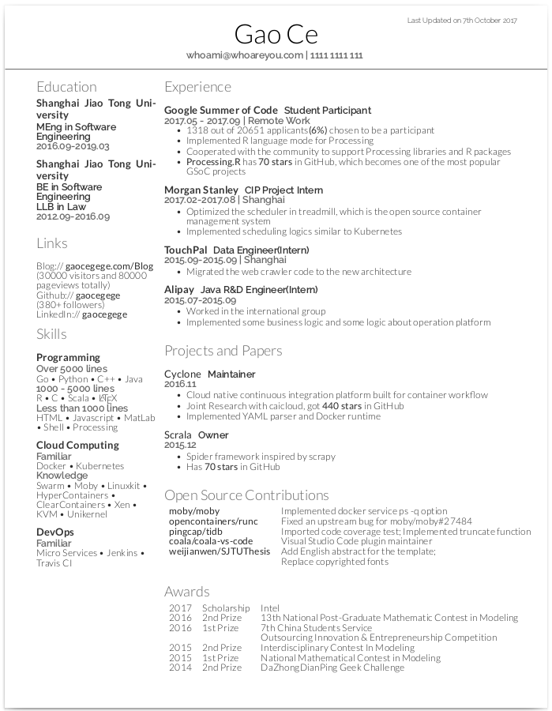

Deedy-Resume-For-Chinese
=========================

[Deedy-Resume](https://github.com/deedydas/Deedy-Resume) 的中文支持版本，适合应届毕业生使用。与其他相比，该模板：

1. 实现简单，便于改写
2. 两栏式设计，可以将简历保持在一页

但与此同时，也带来了整体略显凌乱，容易抓不住重点等问题，个人建议可配合加粗重点内容来使用。

目前有三种字体支持，其中 `OpenFonts` 是开源英文字体，不支持中文简历；`OpenFonts.Chinese` 是开源中文字体；`MacFonts` 是 MacOS 所带字体，目前对此不维护。

## Preview

### OpenFonts for Chinese

中文字体方面，选择了[思源黑体](https://github.com/adobe-fonts/source-han-sans)和[思源宋体](https://github.com/adobe-fonts/source-han-serif)，是目前比较流行的开源字体选择。

	

### OpenFonts

在上游 repo 中，作者选择了 [Lato](https://fonts.google.com/specimen/Lato) 和 [Raleway](https://fonts.google.com/specimen/Raleway)。个人并不是很喜欢 Raleway 字体中 `W` 的形状，因此选择了更换了 [source-sans-pro](https://github.com/adobe-fonts/source-sans-pro)，而为了配套，将 Lato 更换成了 [source-serif-pro](https://github.com/adobe-fonts/source-serif-pro)。

如果你想自己选择字体，推荐阅读 [Resume: A Tale of Desire, Intrigue, and Formatting](http://www.zackgrossbart.com/hackito/resume/)，这篇文章列举了很多开源的字体选择。

	

### MacFonts

由于机器原因不维护该版本模板，请前往[上游](https://github.com/deedy/Deedy-Resume/tree/master/MacFonts)查看。

## Dependencies

1. Compiles only with **XeTeX** and required **BibTex** for compiling publications and the .bib filetype.

## Known Issues:

1. Hacky space on the first bullet point on the second column.
1. Hacky redefinition of \refname to omit 'References' text for publications in the MacFonts version.

## 致谢

* 感谢 [Deedy-Resume](https://github.com/deedydas/Deedy-Resume) 提供的模板主体
* 感谢 [adobe-fonts](https://github.com/adobe-fonts) 的开源字体[思源黑体](https://github.com/adobe-fonts/source-han-sans)，[思源宋体](https://github.com/adobe-fonts/source-han-serif)，[source-sans-pro](https://github.com/adobe-fonts/source-sans-pro) 和 [source-serif-pro](https://github.com/adobe-fonts/source-serif-pro)

## License

Apache 2.0 协议开源，字体部分详见其对应开源协议
